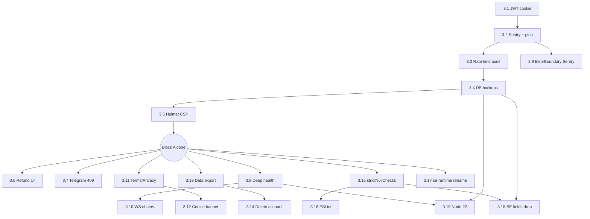

# Phase 3 Roadmap

## Overview

- **Blocks**: 5 (A security-critical, B operational, C compliance, D tech debt, E scaling-deferred).
- **Active sub-PRs**: 19 (A: 5, B: 5, C: 4, D: 5 — Block E listed only, not scoped).
- **Estimated effort (solo dev, prod-as-dev)**: ~22–31 working days for A+B+C+D; Block E re-planned on demand.
- **Risk profile**: Block A medium-high (auth/cookies, log plumbing, CSP); Block B low-medium; Block C low-medium; Block D low per PR but cumulative with one HIGH-risk destructive schema change (PR 3.18); Block E is architectural — defer.
- **One PR per day rule** — after merge, ≥15 min observation before starting the next PR.
- **Block A must fully ship before any further Block B/C/D work.**

## Carry-overs from Phase 2 tech-debt backlog

TD-1..TD-9 live in [PHASE3_TECH_DEBT.md](PHASE3_TECH_DEBT.md). This roadmap maps each into a concrete Block D PR, plus adds items the backlog didn't capture (see "Newly surfaced" under each block).

---

## BLOCK A — Security Critical

**Ship order is fixed**: A.1 → A.2 → A.3 → A.4 → A.5. No skipping.

### PR 3.1 — JWT: httpOnly refresh cookie + in-memory access token

- **Scope**: Move the long-lived refresh token out of `localStorage` into a `httpOnly; Secure; SameSite=Lax` cookie. Keep access token in memory (Zustand non-persisted) with a 15-min TTL; on 401, axios interceptor calls `POST /auth/refresh` which reads the cookie and returns a fresh access token. Delete the cookie on logout. Migrate Google OAuth callback to set cookie instead of returning token in URL.
- **Files**:
  - Backend: [backend/src/main.ts](liquidityscan-web/backend/src/main.ts) (add `cookie-parser` middleware), [backend/src/auth/auth.controller.ts](liquidityscan-web/backend/src/auth/auth.controller.ts) (login/refresh/logout read/write cookies), [backend/src/auth/auth.service.ts](liquidityscan-web/backend/src/auth/auth.service.ts) (return access+refresh pair, split response shape), [backend/src/auth/strategies/google.strategy.ts](liquidityscan-web/backend/src/auth/strategies/google.strategy.ts) (callback sets cookie then 302).
  - Frontend: [frontend/src/services/userApi.ts](liquidityscan-web/frontend/src/services/userApi.ts) (drop `localStorage.getItem('token')`, add `withCredentials: true`, in-memory token ref, 401 → refresh → retry), [frontend/src/store/authStore.ts](liquidityscan-web/frontend/src/store/authStore.ts) (remove token persistence), login/OAuth callback pages.
  - Deps: `cookie-parser` (+ `@types/cookie-parser` dev).
- **Risk**: HIGH. Touches every authenticated request. CORS `credentials: true` is already set but `SameSite` + domain scope must match `FRONTEND_URL`. Mis-configuration = total login break.
- **POST-DEPLOY IMPACT**: all current users with `localStorage.token` will be logged out simultaneously (new code only reads cookie). Since active testers exist, announce migration window in advance (Telegram chat / email). Alternative: ship a graceful 1-week dual-support window (backend accepts both `localStorage`-bearer AND cookie) as a safer but more complex option — decide before implementation starts.
- **Dependencies**: none (first PR).
- **Verification**:
  - Chrome DevTools → Application → Cookies → see `rt` (refresh) cookie flagged `HttpOnly`, `Secure`, `SameSite=Lax`. `localStorage.token` absent.
  - Live run: login → close tab → reopen → still logged in. Access token expires in 15 min → silent refresh on next API call → no re-login prompt.
  - Smoke: `curl -b cookie.jar -c cookie.jar -X POST /auth/login` then `curl -b cookie.jar -X POST /auth/refresh` returns fresh access token.
  - Manual logout → cookie cleared, next refresh → 401.
- **Estimated effort**: 1.5–2 days (single-shot migration); +0.5 day if dual-support option is chosen.

### PR 3.2 — Sentry + structured logging (backend + frontend)

- **Scope**:
  - Backend: add `@sentry/node` + `@sentry/profiling-node`. Global Nest exception filter reports `5xx` + unexpected to Sentry. Add `pino` + `nestjs-pino` for JSON-structured request logs with request-id middleware. Env flags: `SENTRY_DSN`, `SENTRY_SAMPLE_RATE`, `LOG_LEVEL`.
  - Frontend: add `@sentry/react`. Wire into existing [frontend/src/components/ErrorBoundary.tsx](liquidityscan-web/frontend/src/components/ErrorBoundary.tsx) as the `onError` reporter. Strip PII (email, auth cookies, any `token`) in `beforeSend`.
  - Scrub rules: never log request bodies on `/auth/*`, `/payments/*`, `/admin/*`.
- **Files**:
  - Backend: [backend/src/main.ts](liquidityscan-web/backend/src/main.ts), new `backend/src/common/sentry.filter.ts`, new `backend/src/common/logger.config.ts`, [backend/src/app.module.ts](liquidityscan-web/backend/src/app.module.ts) (import `LoggerModule`), [backend/.env.example](liquidityscan-web/backend/.env.example).
  - Frontend: [frontend/src/main.tsx](liquidityscan-web/frontend/src/main.tsx), [frontend/src/components/ErrorBoundary.tsx](liquidityscan-web/frontend/src/components/ErrorBoundary.tsx).
- **Risk**: MEDIUM. Logger replacement can double-log or swallow Nest internals — run with both loggers side-by-side behind a flag for 24h before removing old `console.log`.
- **Dependencies**: PR 3.1 (so that auth scrubbing rules target cookies, not URL-params).
- **Verification**:
  - Throw a synthetic error behind `/debug/throw-sentry` (feature-flag, admin-only) → appears in Sentry within 30s.
  - Frontend: open a page that triggers a React throw → Sentry receives it with stack + release tag.
  - `pm2 logs liquidityscan-api` lines are now single-line JSON with `requestId`, `userId`, `path`, `status`, `durationMs`.
- **Estimated effort**: 1.5 days.

### PR 3.3 — Rate limiting audit on payment / admin / webhooks

- **Scope**: Throttler is already installed and global. Extend per-route caps on the hot / abusable endpoints and add IP-based throttling (instead of the default in-memory key) for unauthenticated routes. Document the table of limits.
- **Files**:
  - [backend/src/payments/payments.controller.ts](liquidityscan-web/backend/src/payments/payments.controller.ts) (add `@Throttle` to `POST /payments`, webhook, subscription-activate),
  - `backend/src/admin/admin.controller.ts` (tight per-IP on mutating routes),
  - [backend/src/app.module.ts](liquidityscan-web/backend/src/app.module.ts) (optional: swap `ThrottlerModule` storage to Redis only if Block E lands; otherwise stay in-memory and document single-instance assumption).
- **Risk**: LOW. Misconfigured limit just bounces requests — reversible.
- **Dependencies**: none in-block (can ship right after PR 3.2).
- **Verification**:
  - `for i in $(seq 1 15); do curl -s -o /dev/null -w "%{http_code} " /api/payments; done` → first N succeed, rest return 429.
  - `pm2 logs` shows `ThrottlerException` count matching observed 429s.
  - Admin mutating routes cannot be hit >5/min/IP.
- **Estimated effort**: 0.5 day.

### PR 3.4 — Automated DB backups (cron + off-box retention)

- **Scope**: Daily `pg_dump -Fc` to `/var/backups/liquidityscan/YYYY-MM-DD.dump`. Retain 14 daily + 8 weekly (rolling). Off-box copy to Backblaze B2 (cheapest, S3-compatible) via `rclone`. Alert on failure via (a) Telegram admin chat (reuse `TelegramService`), (b) native cron `MAILTO=<admin-email>` as independent fallback — if the backend process itself is down along with the backup script, native mail remains an alternative channel. Both channels must succeed during the restore rehearsal. Add a `/admin/backups` read-only route listing the last 20 dumps + sizes + status.
- **Files**:
  - New `scripts/backup-db.sh` (idempotent, exits non-zero on failure, posts to Telegram webhook and exits non-zero so cron triggers MAILTO).
  - New `/etc/cron.d/liquidityscan-backup` (deployed via a README install step, not committed to `/etc`) with `MAILTO=<admin>` at the top.
  - New `backend/src/admin/backups.controller.ts` + service method using `fs.readdir`.
  - Docs: `liquidityscan-web/backend/docs/BACKUPS.md` with restore runbook + instructions for configuring the host's MTA (`msmtp` or `postfix`-satellite) so `MAILTO` actually delivers.
- **Risk**: MEDIUM. Dump during peak IO can stall WS scanner — schedule for 04:30 UTC (off-hours for all active markets). Secrets for B2 go in `/etc/liquidityscan-backup.env` (root-only read), not committed.
- **Dependencies**: none.
- **Verification**:
  - First cron run → dump exists, size > 0, B2 copy lands.
  - Simulate failure (`pg_dump -h nonexistent`) → Telegram alert posted AND `MAILTO` email received within 5 min.
  - Restore rehearsal on a temp schema: `pg_restore --dbname=liquidityscan_restore_test …` completes + row counts match.
- **Estimated effort**: 1 day.

### PR 3.5 — Helmet CSP hardening

- **Scope**: Enable CSP unconditionally (drop `HELMET_CSP` gate). Tighten current directives: drop `'unsafe-eval'` (audit which libs need it — TanStack DevTools? Lightweight-charts? If dev-only, keep via `NODE_ENV==='development'`). Add `report-uri` to a Sentry CSP endpoint so violations are visible. Review `frame-ancestors`, `upgrade-insecure-requests`, `object-src 'none'`.
- **Files**: [backend/src/main.ts](liquidityscan-web/backend/src/main.ts) only.
- **Risk**: MEDIUM. Over-tight CSP breaks YouTube embeds in courses, Google OAuth popup, or chart libs. Staged rollout: first ship `Content-Security-Policy-Report-Only` for 48h, then flip to enforce.
- **Dependencies**: PR 3.2 (Sentry DSN ready to receive CSP reports).
- **Verification**:
  - `curl -I /api/` → `Content-Security-Policy:` header present with `object-src 'none'`, no `unsafe-eval` in prod.
  - 48h in report-only: zero violations for normal flows (login, watch course, check signal, pay).
  - Flip to enforce, re-test same flows.
- **Estimated effort**: 0.5 day.

### Newly surfaced in Block A

- **A.6 (optional)**: Add a `POST /auth/logout-all` that invalidates all refresh tokens for a user (requires a `RefreshToken` table with `revokedAt`). Only if PR 3.1 leaves a visible gap.

---

## BLOCK B — Operational Resilience

Can interleave with Block C/D once Block A fully deployed.

### PR 3.6 — Admin UI "Refund" button (TD-6)

- **Scope**: Surface the existing `PUT /admin/payments/:id/refund` backend. Button visible only for `status='completed'`. Keep "Cancel" for `pending|failed` only. Toast distinguishes `alreadyRefunded: true` vs fresh refund.
- **Files**: `frontend/src/pages/admin/Payments.tsx`, `frontend/src/services/adminApi.ts`.
- **Risk**: LOW. Backend already tested (PR 2.5a).
- **Dependencies**: none.
- **Verification**: manual refund on a test payment → DB: `payment.status='refunded'`, `user.tier='FREE'`, `userSubscription.status='cancelled'`. Second click → "already refunded" toast.
- **Estimated effort**: 0.5 day.

### PR 3.7 — Telegram 409 conflict handling (TD-7)

- **Scope**: Detect `409 Conflict` in `onPollingError`, classify, backoff, cap log noise. Add `pg_try_advisory_lock(<bot-hash>)` at bot startup so only one API instance polls (Redis-free, zero-new-infra as per TD-7 option).
- **Files**: [backend/src/telegram/telegram.service.ts](liquidityscan-web/backend/src/telegram/telegram.service.ts), new `backend/src/telegram/polling-lock.ts`.
- **Risk**: LOW. Lock is held by session; if process crashes, PG releases automatically.
- **Dependencies**: none.
- **Verification**: run two local Nest processes against the same bot token → only the first polls, second logs `polling lock held elsewhere, skipping`. Error log grep `409 Conflict` → 0 after 1h of steady state.
- **Estimated effort**: 0.5–1 day.

### PR 3.8 — Deep health check

- **Scope**: Replace flat `/health` with `/health/live` (process up) + `/health/ready` (DB `SELECT 1`, Binance WS `isOpen`, scanner last-tick age, Telegram bot polling flag). Return 503 if any critical is red. Include in backups alert stack.
- **Files**: [backend/src/app.controller.ts](liquidityscan-web/backend/src/app.controller.ts) (split endpoints), new `backend/src/common/health/*.indicator.ts` (one indicator per subsystem), [backend/src/candles/binance-ws.manager.ts](liquidityscan-web/backend/src/candles/binance-ws.manager.ts) (expose `getHealth()` + `lastPongAt`).
- **Risk**: LOW.
- **Dependencies**: none.
- **Verification**: `curl /api/health/ready` → 200 with JSON of all four subsystems. Stop `postgres` service → 503 within ~5s.
- **Estimated effort**: 1 day.

### PR 3.9 — ErrorBoundary → Sentry wiring

- **Scope**: Wire the existing [ErrorBoundary.tsx](liquidityscan-web/frontend/src/components/ErrorBoundary.tsx) to send captured errors to Sentry via `Sentry.captureException`, and show a branded fallback with "send feedback" button using `Sentry.showReportDialog`.
- **Files**: [frontend/src/components/ErrorBoundary.tsx](liquidityscan-web/frontend/src/components/ErrorBoundary.tsx).
- **Risk**: LOW.
- **Dependencies**: **PR 3.2** (Sentry must be initialized first).
- **Verification**: trigger a `throw` inside any lazy-loaded page → Sentry event with component stack.
- **Estimated effort**: 0.25 day.

### PR 3.10 — BinanceWS observability (metric export, already has pong-timeout)

- **Scope**: pong-timeout reconnect already implemented — just export `{connectedStreams, lastPongAt, reconnectCount24h}` from `BinanceWsManager` into the PR 3.8 health endpoint. No behavioral change.
- **Files**: [backend/src/candles/binance-ws.manager.ts](liquidityscan-web/backend/src/candles/binance-ws.manager.ts).
- **Risk**: LOW.
- **Dependencies**: PR 3.8.
- **Verification**: `curl /api/health/ready` includes a `binanceWs` block with non-null `lastPongAt` and reconnect count.
- **Estimated effort**: 0.25 day.

### Already done — skip

- **transitionSignal P2025**: guards exist in [lifecycle.service.ts](liquidityscan-web/backend/src/signals/lifecycle.service.ts) at 5 call-sites via static `isPrismaRecordNotFound`. No new PR.
- **Frontend ErrorBoundary component**: already wired in [App.tsx](liquidityscan-web/frontend/src/App.tsx). Only the reporter needs wiring (PR 3.9).

---

## BLOCK C — Compliance (pre-EU-user)

Greenfield — no current terms/privacy/cookie/gdpr files anywhere in repo.

### PR 3.11 — Terms of Service + Privacy Policy pages

- **Scope**: Static MDX pages at `/legal/terms` and `/legal/privacy`. Start from an open-source SaaS template (Vercel's, GitHub's) adapted for LiquidityScan: signal data is informational-only, not financial advice; payment processing handled off-site (Tron payments); user data categories listed. Link from footer + signup screen. Visible footer disclaimer on both pages: "Draft — pending legal review. Not a binding contract until finalized." Until a lawyer review, these pages are placeholders meeting the minimum disclosure requirement, **not** comprehensive legal protection.
- **Files**: new `frontend/src/pages/legal/Terms.tsx`, `frontend/src/pages/legal/Privacy.tsx`, router entries, footer update.
- **Risk**: LOW legally for solo-dev in draft mode (the "Draft" marker is the mitigation); flag that a lawyer review is pending.
- **Dependencies**: none.
- **Verification**: both pages render, both show the Draft disclaimer footer. Signup page has mandatory checkbox "I agree to Terms + Privacy".
- **Estimated effort**: 0.5 day (content + wire).

### PR 3.12 — Cookie consent banner (granular)

- **Scope**: Three categories: necessary (always on, disabled toggle), analytics (Sentry session replay + any GA), marketing (off by default). Persist choice in `localStorage` (lightweight, no cookie about cookies). Show banner ALWAYS on first visit (no geo-based conditional) — the banner is low-friction enough that showing to non-EU users is not a UX problem, and this approach guarantees EU compliance regardless of CDN setup.
- **Files**: new `frontend/src/components/CookieConsent.tsx`, [frontend/src/App.tsx](liquidityscan-web/frontend/src/App.tsx) (mount banner).
- **Risk**: LOW.
- **Dependencies**: PR 3.11 (banner links to privacy page).
- **Verification**: first load in incognito → banner shown. Accept-all → `localStorage.cookieConsent === '{"necessary":true,"analytics":true,"marketing":true}'`. Refusing analytics disables Sentry session replay only (error capture still on, since necessary-category).
- **Estimated effort**: 0.5 day.

### PR 3.13 — GDPR data export endpoint

- **Scope**: `GET /users/me/export` returns a single JSON containing: user profile, subscription history, payments, affiliate state, signals the user favorited/alerted on, alert config. Rate-limit 1 export per 24h per user. Frontend: "Download my data" button in account settings.
- **Files**: new `backend/src/users/data-export.service.ts`, `backend/src/users/users.controller.ts` (new route), frontend account settings page.
- **Risk**: LOW. Read-only.
- **Dependencies**: PR 3.3 (rate-limit + `@Throttle`).
- **Verification**: endpoint returns ~200KB JSON for a full user, all owned rows present, no other user's data bleeds.
- **Estimated effort**: 0.5 day.

### PR 3.14 — GDPR delete-account endpoint (right to be forgotten)

- **Scope**: `DELETE /users/me` with password reconfirm. Atomically: anonymize `email → deleted_<userId>@anon.local`, scrub `name`, set `deletedAt`, delete tokens/sessions, detach affiliate referrals (retain aggregate counts, null the FK), cascade-delete user-owned alerts. Keep payments (financial records — explicit retention note in privacy policy). Frontend flow with double-confirmation.
- **Files**: new `backend/src/users/delete-account.service.ts`, route on `users.controller.ts`, account-settings page in frontend, `prisma/schema.prisma` (+ `deletedAt DateTime?` + migration).
- **Risk**: MEDIUM. Cascading deletes against live FKs needs careful migration + tx. Run against a fresh staging dump before prod.
- **Dependencies**: PR 3.13 (export comes first per GDPR best practice — user exports, then deletes).
- **Verification**: test user: export → delete → attempt login → 401. DB: `email` anonymized, `deletedAt` set, alerts gone, payments kept with FK pointing at the tombstoned user.
- **Estimated effort**: 1 day.

---

## BLOCK D — Tech Debt Cleanup

Order sensitive: TD-4 before TD-5 (per TD-5 blocker note). TD-1/TD-2/TD-3 can batch.

### PR 3.15 — TD-4 strictNullChecks flip (likely split by module)

- **Scope**: See [PHASE3_TECH_DEBT.md](liquidityscan-web/PHASE3_TECH_DEBT.md) TD-4. Flip in a throwaway branch → bucket errors → split into 2–3 module-scoped PRs if >100 hits.
- **Files**: `backend/tsconfig.json` + whichever modules the error bucket points at.
- **Risk**: MEDIUM cumulative; each sub-PR is LOW.
- **Dependencies**: none.
- **Verification**: `npx tsc --noEmit` clean after each sub-PR, full test suite green.
- **Estimated effort**: 2–4 days across sub-PRs.

### PR 3.16 — TD-5 backend ESLint + `no-explicit-any: error`

- **Scope**: See TD-5.
- **Files**: new `backend/eslint.config.mjs`, `backend/package.json` (`lint` script). Optionally tighten `frontend/eslint.config.js`.
- **Risk**: LOW (lint-only).
- **Dependencies**: PR 3.15 (avoid fixing the same errors twice).
- **Estimated effort**: 0.5–1 day.

### PR 3.17 — TD-1 / TD-3 se-runtime naming cleanup

- **Scope**: Batch TD-1 (`SeProcessResult.result_v2 → result`, `result_type → reason`) + TD-3 (`SeRuntimeSignal.state → lifecycle_state`, purge legacy `status`).
- **Files**: `backend/src/signals/se-runtime.ts`, `backend/src/signals/se-runtime.spec.ts`, [backend/src/signals/lifecycle.service.ts](liquidityscan-web/backend/src/signals/lifecycle.service.ts).
- **Risk**: LOW (internal rename, type-checked).
- **Dependencies**: none.
- **Estimated effort**: 0.5 day.

### PR 3.18 — TD-2 legacy SE fields drop (9 columns including `se_close_reason`)

- **Scope**: Introduce shared `close_reason` enum column applicable across CRT/3OB/SE; backfill from existing rows; migrate `SignalStatusBadge` + `InteractiveLiveChart` + `SignalDetails` to read the new column; drop all 9 legacy columns in a follow-up migration with zero-downtime protocol (shadow-read window).
- **Files**: `prisma/schema.prisma`, new migration, `lifecycle.service.ts`, scanners, frontend `SignalStatusBadge.tsx`, `InteractiveLiveChart.tsx`, `SignalDetails.tsx`.
- **Risk**: HIGH — destructive schema change dropping 9 columns, plus a 3-component frontend refactor with cross-strategy (CRT/3OB/SE) semantics. Comparable in complexity to PR 2.3 in Phase 2.
- **Dependencies**:
  - **PR 3.4** (backups must be automated and proven for ≥7 days before any destructive schema change).
  - **PR 3.15 (strictNullChecks)** recommended first so the new `close_reason` column is properly null-typed from the start, avoiding a round-trip fix later.
- **Estimated effort**: 3–4 days (backfill + dual-read migration + three component refactors + staged drop).

### PR 3.19 — TD-9 Node 22 upgrade + drop `--experimental-require-module`

- **Scope**: TD-9. Install Node 22 via `nvm` in parallel — **keep Node 20 installed, add Node 22 alongside**. Boot a separate PM2 instance `liquidityscan-api-n22` on port 4001 pointing at the current `dist/`, with `--experimental-require-module` still set (so the existing build runs identically on both Node versions). Run the full `/health/ready` suite against :4001 for 24h in parallel with the production :4000 instance. If clean:
  1. `pm2 stop liquidityscan-api` (old Node 20 instance),
  2. `nvm alias default 22`,
  3. remove `--experimental-require-module` from [ecosystem.config.cjs](liquidityscan-web/backend/ecosystem.config.cjs) `NODE_OPTIONS`,
  4. `pm2 restart liquidityscan-api` (now on Node 22, flag-free),
  5. `pm2 delete liquidityscan-api-n22`.
  Declare `engines.node: ">=22"` in `backend/package.json`. Path B fallback: convert `satori-html` import in [telegram.service.ts](liquidityscan-web/backend/src/telegram/telegram.service.ts) to dynamic `await import(...)`. Path C fallback: drop `satori-html` entirely if image cards are unused.
- **Rollback path**: if Node 22 issues appear after the switch, `pm2 stop liquidityscan-api`, `nvm use 20`, restore the `--experimental-require-module` line, `pm2 restart liquidityscan-api` — the existing `dist/` works on either Node version because the flag is additive (Node 22 ignores it).
- **Files**: `ecosystem.config.cjs`, `backend/package.json` (`engines.node: ">=22"`), maybe `telegram.service.ts`.
- **Risk**: MEDIUM (Node runtime change) — mitigated by parallel-install strategy above.
- **Dependencies**: PR 3.4 (backups) + PR 3.8 (deep health to confirm post-upgrade on :4001 before the switch).
- **Estimated effort**: 1 day hands-on + 24h parallel-soak wall-clock.

### Newly surfaced in Block D

- **PR 3.20 (optional)**: `Subscription.tier` / `Affiliate.tier` String → Enum promotion (not tracked in TDs). 0.5 day. Defer unless a new `tier` value is about to be added.
- **PR 3.21 (optional)**: Throttler storage → Redis. Only when Multi-instance lands (Block E).

---

## BLOCK E — Scaling (Deferred)

List only. Re-plan when a real performance signal (p95 > 1s on hot endpoints, or > 80% event-loop utilization, or `signals[]` memory > 500MB) appears.

- Scanner → BullMQ worker process (isolate CPU from API).
- Redis cache for in-memory `signals[]` (survives restart, enables multi-instance).
- Multi-instance readiness: WebSocket sticky routing via nginx or socket.io-redis adapter.
- CI/CD pipeline + staging environment (currently prod = dev; only acceptable while solo).

---

## Execution Strategy

- **One PR per day rule** holds. Merge → 15-min observation → next PR.
- **Block A is fully linear**: 3.1 → 3.2 → 3.3 → 3.4 → 3.5.
- **Block B, C, D can interleave** after Block A ships — pick by current risk exposure.
- **Block E is frozen** until a measurable scaling signal appears.
- **Destructive schema changes (PR 3.18) gate on PR 3.4 (backups)** — don't drop columns before the cron is proven green for ≥7 days.

## Out of Scope for Phase 3

- Kubernetes, Docker Compose, or any container migration.
- Multi-region / HA database.
- Email deliverability overhaul (SPF/DKIM/DMARC review) — do if deliverability becomes a visible problem. Note: PR 3.4's `MAILTO` fallback needs only a local MTA, not a full deliverability story.
- i18n / localization framework (no user-facing non-EN content planned in Phase 3).
- Public API / webhooks for third-party integration.
- Dark/light theme toggle (cosmetic).
- WASM-based charting or signal replay UI.
- Any new strategy scanner (SMC, order-block, session-sweep) — product-scope, not Phase 3.
