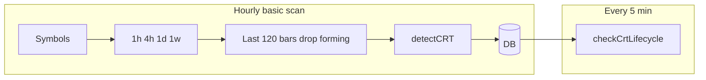

# CRT (Candle Range Theory) Scanner — How It Works

This document describes how **CRT** is implemented in Liquidity Scanner: detection rules, data flow, persistence, lifecycle, and the UI. It reflects the current backend and frontend code under `liquidityscan-web/`.

---

## 1. What CRT means in this product

**CRT** stands for **Candle Range Theory** in our codebase. The scanner looks for a specific **liquidity sweep** pattern on two consecutive **fully closed** candles:

- Price **wicks** beyond the **previous** candle’s high or low (a sweep of that level).
- The **current** candle’s **body** (open and close) remains **inside** the previous candle’s range (between previous low and previous high, strictly—equal prices at the boundary do not qualify).
- The **previous** candle has a **larger body** than the **current** candle (`|prev.close − prev.open| > |curr.close − curr.open|`).

**Bullish CRT** → **`BUY`** (sweep of lows). **Bearish CRT** → **`SELL`** (sweep of highs).

---

## 2. Detection algorithm (exact rules)

**Implementation:** [`backend/src/signals/indicators/crt.detect.ts`](../backend/src/signals/indicators/crt.detect.ts) → `detectCRT(candles: CandleData[])`.

### Inputs

- OHLC candles ordered by time (`openTime`, `open`, `high`, `low`, `close`, `volume`).
- Only the **last** candle and the **previous** one: `prev = candles[length-2]`, `curr = candles[length-1]`.

### Bullish / bearish / conflict

Same boolean rules as in code (wick break, strict body-inside-range, `prevBody > currBody`). If **both** bull and bear are true on the same bar, return **`null`**.

Return fields: `direction`, `barIndex`, `time` (`curr.openTime`), `price` (`curr.close`), `sweptLevel`, `prevHigh`, `prevLow`, `sweepExtreme`.

---

## 3. Timeframes

CRT runs on **1h**, **4h**, **1d**, **1w** — see [`scanner.service.ts`](../backend/src/signals/scanner.service.ts) and [`webhook-signal.dto.ts`](../backend/src/signals/dto/webhook-signal.dto.ts) (`CRT_TIMEFRAMES`).

---

## 4. When and how the backend runs the scan

### Scheduler

- **`ScannerService.scanBasicStrategies()`** — scheduled on each clock hour (`scheduleBasicScanOnTheHour()`).
- Symbols from `fetchSymbols()`, chunked for rate limits.

### Per symbol and timeframe

1. Candles from **WS memory** or **DB snapshots** (same path as other scanners in `scanSymbol`).
2. Pass **`c.slice(-120)`** (last 120 bars) into [`CrtScanner.scanFromCandles`](../backend/src/signals/scanners/crt.scanner.ts).
3. **`closedCandles = candles.slice(0, -1)`** — drop the forming bar.
4. Need **≥ 2** closed bars; run **`detectCRT(closedCandles)`**.
5. If non-null, persist via [`saveScannerSignal`](../backend/src/signals/scanner-persistence.helper.ts) → **`SignalsService.addSignals`** with `strategyType: 'CRT'`.

`CrtScanner.scan()` (REST `getScannerCandles` / 500 klines) exists for tests or ad-hoc use; **hourly market scan uses `scanFromCandles` with the 120-bar window**, not that path.

### Signal ID and archive

- ID: **`CRT-{SYMBOL}-{TIMEFRAME}-{openTimeMs}`**.
- After insert, **`archiveOldSignals('CRT', symbol, timeframe)`** (fire-and-forget): keeps **only the latest row** by `detectedAt`; **does not** resurrect `COMPLETED`/`EXPIRED` to `ACTIVE` (unlike some other strategies). Older ids for the same symbol+TF are **deleted**.

### Stored metadata

| Key | Description |
|-----|-------------|
| `crt_direction` | `BULLISH` / `BEARISH` |
| `swept_level` | Swept level |
| `prev_high` / `prev_low` | Prior range |
| `sweep_extreme` | Wick extreme on signal candle |

Initial lifecycle: `lifecycleStatus` / `status` **`PENDING`** (from persistence helper).

---

## 5. Lifecycle (STRONG / WEAK / FAILED)

**Implementation:** [`lifecycle.service.ts`](../backend/src/signals/lifecycle.service.ts) → **`checkCrtLifecycle()`**, invoked from **`checkAllSignals()`** every **5 minutes**.

CRT is **not** closed by percent TP/SL from `STRATEGY_CONFIG` (that map is used for other flows; it does **not** define CRT TP/SL in the current code).

### Rules (summary)

For each open CRT row with metadata `prev_high` / `prev_low` and entry reference **`price`** (signal close):

1. Wait until at least **one** full TF candle has elapsed since `detectedAt` (`candlesSince >= 1`).
2. Load up to **`CRT_LIFECYCLE_KLINE_LIMIT` (120)** klines, take **closed** bars only.
3. Build **`postSignal`**: all closed candles with **`openTime > detectedAt`**, sorted ascending by time.
4. **First reaction candle** = `postSignal[0]`; **second** = `postSignal[1]` when `candlesSince >= 2`.
5. Classify using **close** of the first candle (and second if needed), vs **`prevHigh` / `prevLow` / `entry`**:
   - **BUY:** `STRONG` if close > prevHigh; else `WEAK` if close > entry; else `FAILED` if close < entry; ambiguous second bar can flip outcome; if still undecided after two bars elapsed → **FAILED**.
   - **SELL:** symmetric with `prevLow` and below-entry logic.
6. Transition to **`COMPLETED`** with `result` WIN/LOSS and `se_close_reason` **`STRONG` | `WEAK` | `FAILED`**.

### Cleanup

- **`deleteStaleCrtCompleted()`** — hard-delete **`COMPLETED`** CRT rows with **`closedAt`** older than **24h**.
- **`deleteStaleCompletedGlobal()`** — CRT stuck **> 48h** still `PENDING`/`ACTIVE` → force **`COMPLETED`** with `STUCK_EXPIRED` (flat 48h cutoff for CRT).

---

## 6. Alerts and integrations

- **Telegram:** CRT blocks use direction, swept level, extremes, prev high/low from metadata when present.
- **API / webhooks:** `strategyType: 'CRT'`, allowed TFs per DTO.
- **Frontend:** `/monitor/crt`, `MonitorCRT.tsx`, `SignalDetails.tsx` for CRT id prefix / type.

---

## 7. Mental model

---

## 8. Code map

| Area | File |
|------|------|
| Detection | `backend/src/signals/indicators/crt.detect.ts`, `candle-types.ts` (`CRTSignal`) |
| Scanner | `backend/src/signals/scanners/crt.scanner.ts` |
| Orchestration | `backend/src/signals/scanner.service.ts` |
| Persist + archive | `backend/src/signals/scanner-persistence.helper.ts`, `signals.service.ts` (`archiveOldSignals` CRT branch) |
| Lifecycle | `lifecycle.service.ts` (`checkCrtLifecycle`, `CRT_LIFECYCLE_KLINE_LIMIT`, `deleteStaleCrtCompleted`, stuck in `deleteStaleCompletedGlobal`) |
| API TFs | `backend/src/signals/dto/webhook-signal.dto.ts` |
| UI | `frontend/src/pages/MonitorCRT.tsx`, `SignalDetails.tsx` |
| Telegram | `backend/src/telegram/telegram.service.ts` |
| Knowledge pointer | [`knowledge/CRT-CANON.md`](../knowledge/CRT-CANON.md) |

---

*Update this file when detection, scan window, lifecycle, or archive rules change.*
