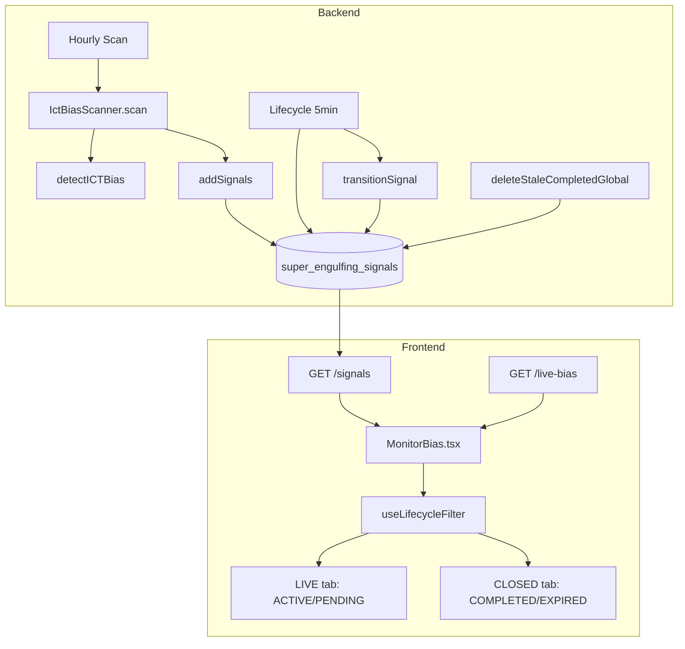

# ICT Bias (ICT_BIAS) — Full Architecture, Lifecycle and UI Distribution

## Why this document exists

This document is the **single source of truth** for how ICT Bias signals are created, validated, distributed between UI tabs (LIVE vs CLOSED), and cleaned up. Hand it to an AI or human reviewer to verify the implementation is correct and consistent across backend and frontend.

**Companion bundle:** Source files referenced here are packaged as [`ict-bias-source.zip`](ict-bias-source.zip) in this `docs/` folder.

---

## 1. High-level flow

```mermaid
sequenceDiagram
    participant Scan as Hourly Market Scan
    participant DB as Database
    participant LC as Lifecycle Check (every 5 min)
    participant API as GET /signals?strategyType=ICT_BIAS
    participant UI as MonitorBias page

    Scan->>DB: Insert row: lifecycleStatus = ACTIVE
    UI->>API: Fetch all ICT_BIAS signals
    API->>DB: findMany (all statuses)
    API-->>UI: Array of signals
    Note over UI: useLifecycleFilter splits by tab

    rect rgb(40, 80, 40)
        Note over UI: LIVE tab shows PENDING + ACTIVE
    end

    loop Every 5 min while next candle is forming
        LC->>DB: Find ACTIVE ICT_BIAS rows
        LC-->>LC: Next candle not closed yet → skip
        Note over UI: Signal stays in LIVE tab
    end

    Note over LC: Next candle closes
    LC->>DB: Compare nextClose vs bias_level → WIN or FAILED
    LC->>DB: Set lifecycleStatus = COMPLETED

    rect rgb(80, 40, 40)
        Note over UI: Signal moves to CLOSED tab
    end

    Note over LC: After 24h → hard delete from DB
```



---

## 2. Signal lifecycle states and UI tab mapping

| `lifecycleStatus` | Meaning | UI Tab | How long it stays |
|---|---|---|---|
| **ACTIVE** | Bias detected, waiting for next candle to close | **LIVE** | From scan until next candle closes (4h / 1d / 1w depending on timeframe) |
| **PENDING** | Legacy insert state (treated same as ACTIVE) | **LIVE** | Same as ACTIVE |
| **COMPLETED** | Next candle closed; bias validated as WIN or FAILED | **CLOSED** (a.k.a. "Recent Closed") | Up to **24 hours**, then hard-deleted |
| **EXPIRED** | Rare forced closure (legacy) | **CLOSED** | Up to **24 hours** |

### Frontend filter logic (`useLifecycleFilter`)

```
LIVE tab   →  lifecycleStatus === 'PENDING' || lifecycleStatus === 'ACTIVE'
CLOSED tab →  lifecycleStatus === 'COMPLETED' || lifecycleStatus === 'EXPIRED'
ALL tab    →  no filter
```

**Key point:** A signal appears in LIVE from the moment it is inserted until the lifecycle service validates it (next candle close). After validation it moves to CLOSED. After 24h it is deleted from the database entirely.

---

## 3. Detection rules (`detectICTBias`)

**File:** [`backend/src/signals/indicators/ict-bias.detect.ts`](../backend/src/signals/indicators/ict-bias.detect.ts)

**Input:** ordered `CandleData[]`, minimum length **3**.  
**Index:** `i = candles.length - 1` (last/latest bar).

| Condition | Result |
|---|---|
| `candles[i-1].close < candles[i-2].low` | **BEARISH** bias, direction = SELL |
| `candles[i-1].close > candles[i-2].high` | **BULLISH** bias, direction = BUY |
| Neither | **RANGING** — no signal created |

**Returned values:** `bias`, `direction`, `time` (= `candles[i-1].openTime`), `prevHigh`, `prevLow`.

---

## 4. Scanner insert (`IctBiasScanner.scan`)

**File:** [`backend/src/signals/scanners/ict-bias.scanner.ts`](../backend/src/signals/scanners/ict-bias.scanner.ts)

Runs hourly for each symbol across timeframes `4h`, `1d`, `1w`.

| Field | Value | Notes |
|---|---|---|
| `id` | `ICT_BIAS-{symbol}-{timeframe}-{sig.time}` | Stable per bar open time |
| `strategyType` | `ICT_BIAS` | |
| `lifecycleStatus` | `ACTIVE` | Appears in LIVE tab immediately |
| `detectedAt` | `sig.time` (open time of signal bar) | Used by lifecycle to find the *next* candle |
| `bias_direction` | `BULL` or `BEAR` | Stored as DB column + in metadata |
| `bias_level` | `candles[length - 2].close` | The reference price for WIN/FAILED |
| `price` | `candles[length - 1].close` | Latest candle close at scan time |

**Option A (accuracy-first):** The scanner **only** calls `addSignals` — it does **not** close prior rows. **`LifecycleService`** is the sole owner of ICT Bias completion (next-candle WIN/FAILED) and of `STUCK_EXPIRED` when a row is truly stuck. The same `symbol + timeframe` can therefore have **multiple** PENDING/ACTIVE rows until each is validated or stuck-closed.

---

## 5. Lifecycle validation (next candle body close)

**File:** [`backend/src/signals/lifecycle.service.ts`](../backend/src/signals/lifecycle.service.ts)  
**Runs:** every 5 minutes via `checkAllSignals()`.

### Step-by-step per signal

1. Fetch `getKlines(symbol, timeframe, 5)`.
2. `biasDetectedMs = detectedAt.getTime()`.
3. Find **`nextCandle`** = first kline where **`openTime > biasDetectedMs`** (strictly after the signal bar).
4. If no such candle exists → **skip** (signal stays ACTIVE / LIVE).
5. Check if candle is fully closed: `openTime + tfMs <= now`. If still forming → **skip**.
6. Compare `nextCandle.close` vs `bias_level`:

| Direction | WIN condition | FAILED condition |
|---|---|---|
| **BULL** | `nextClose > bias_level` | `nextClose <= bias_level` |
| **BEAR** | `nextClose < bias_level` | `nextClose >= bias_level` |

7. Transition signal to `lifecycleStatus = COMPLETED` with `result = WIN` or `LOSS`.
8. Update `bias_result`, `bias_validated_at`, `closedAt`, `se_close_price`.

**After this:** signal moves from **LIVE** to **CLOSED** tab in the UI.

---

## 6. How long signals stay in each tab

### LIVE tab duration

Depends on the timeframe — the signal waits for the **next** candle period to fully close:

| Timeframe | Max time in LIVE | Example |
|---|---|---|
| **4h** | Up to ~4 hours | Detected at 12:00, next candle closes at 16:00 |
| **1d** | Up to ~24 hours | Detected at day open, next day candle closes at 00:00 UTC |
| **1w** | Up to ~7 days | Detected at week open, next weekly candle closes Monday 00:00 UTC |

In practice, the signal appears in LIVE within seconds of the hourly scan and stays there until the next candle closes. Lifecycle checks every 5 minutes, so there may be up to a 5-minute delay after candle close before the signal moves to CLOSED.

### CLOSED tab duration

- Signals stay in CLOSED for up to **24 hours** after `closedAt`.
- After 24h, `deleteStaleCompletedGlobal()` (runs every 5 min) hard-deletes ICT_BIAS `COMPLETED` rows from the database.

### Safety net for stuck signals

- ICT_BIAS: if `now - detectedAt` exceeds **`max(48h, 2 × candle length)`** for that timeframe (e.g. **1w → 14 days**), `deleteStaleCompletedGlobal()` force-closes as `COMPLETED` / `LOSS` with `se_close_reason = STUCK_EXPIRED`, `bias_result = FAILED`. Shorter TFs still use an effective **48h** minimum.

---

## 7. Live bias overlay (independent of signal rows)

**File:** [`backend/src/signals/scanners/ict-bias.scanner.ts`](../backend/src/signals/scanners/ict-bias.scanner.ts) — `computeLiveBias(timeframe)`  
**Cache:** 60 seconds in [`scanner.service.ts`](../backend/src/signals/scanner.service.ts).  
**API:** `GET /signals/live-bias?timeframe=4h`

The frontend (`MonitorBias.tsx`) fetches live bias every 65 seconds and **overlays** it on signal rows: if live bias data exists for a signal's symbol+TF, the displayed `bias` and `direction` are updated to match the latest live values — even if the DB row has not changed yet. This keeps the UI current between hourly scans.

---

## 8. Historical bug (fixed) — "all FAILED" / empty LIVE tab

**Previously:** lifecycle used `openTime >= biasDetectedMs`, which matched the **signal bar** itself. That bar's close equals `bias_level` by construction, so strict `>` / `<` always yielded FAILED. All signals flipped to COMPLETED within 5 minutes — LIVE tab was always empty.

**Current fix:** lifecycle uses **`openTime > biasDetectedMs`** so validation waits for the genuinely next candle. Signals now stay ACTIVE (LIVE) for the full duration of the next candle period.

---

## 9. Cleanup summary

| What | When | Notes |
|---|---|---|
| ICT_BIAS `COMPLETED` hard-delete | Every 5 min | `closedAt` older than **24h** (`deleteStaleCompletedGlobal`) |
| ICT_BIAS stuck force-close | Every 5 min | `detectedAt` older than **`max(48h, 2×TF)`** → `STUCK_EXPIRED` |
| Scanner | Each hourly insert | **No** per-scan delete/replace of other ICT_BIAS rows (Option A) |

---

## 10. Files reference

| File | Role |
|---|---|
| [`indicators/ict-bias.detect.ts`](../backend/src/signals/indicators/ict-bias.detect.ts) | Pure detection function |
| [`scanners/ict-bias.scanner.ts`](../backend/src/signals/scanners/ict-bias.scanner.ts) | Scan + insert + live bias |
| [`scanner.service.ts`](../backend/src/signals/scanner.service.ts) | Hourly orchestrator + live bias cache |
| [`signals.service.ts`](../backend/src/signals/signals.service.ts) | addSignals, getSignals (ICT_BIAS live-first sort); `archiveOldSignals` no-op for ICT_BIAS |
| [`lifecycle.service.ts`](../backend/src/signals/lifecycle.service.ts) | 5-min validation + global cleanup |
| [`signal-state.service.ts`](../backend/src/signals/signal-state.service.ts) | Central state transition (P2025-safe) |
| [`prisma/schema.prisma`](../backend/prisma/schema.prisma) | DB model with bias_direction, bias_level, etc. |
| [`frontend/src/pages/MonitorBias.tsx`](../frontend/src/pages/MonitorBias.tsx) | UI page: LIVE/CLOSED tabs, live bias overlay |
| [`frontend/src/hooks/useLifecycleFilter.ts`](../frontend/src/hooks/useLifecycleFilter.ts) | Tab filter: ACTIVE→LIVE, COMPLETED→CLOSED |

---

## 11. Dependency diagram



---

*Last updated: Option A (scanner inserts only; lifecycle closes); TF-aware ICT stuck timeout; candle selector `openTime > detectedAt`. Update if rules change.*
