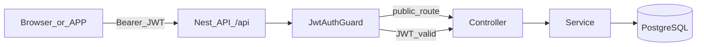
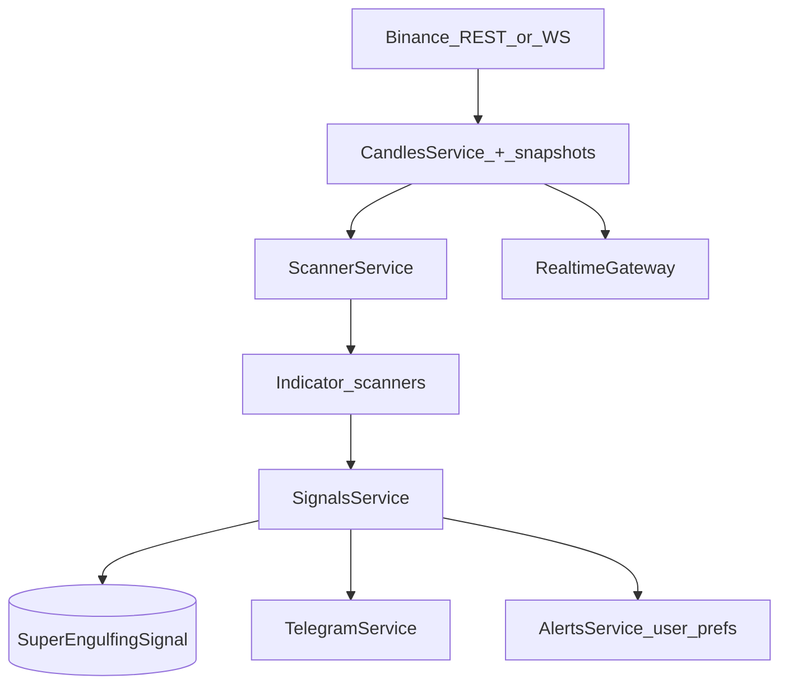

# System architecture

## Boot sequence

1. **Node** loads [`backend/src/main.ts`](../../backend/src/main.ts).
2. `NestFactory.create(AppModule)` builds the DI graph.
3. **Helmet** (optional CSP via `HELMET_CSP=true`), **CORS** from `FRONTEND_URL` (comma-separated), **global prefix** `api`.
4. **ValidationPipe**: `whitelist`, `forbidNonWhitelisted`, `transform`.
5. **Listen** on `PORT` (default 3000), `LISTEN_HOST` (default `127.0.0.1`).
6. **PrismaService** connects on module init; **ScannerService** may schedule hourly scans; **LifecycleService** starts intervals for signal maintenance.

## Global HTTP security

- **JwtAuthGuard** is registered as `APP_GUARD`: every route requires a valid Bearer JWT unless decorated with `@Public()`.
- **ThrottlerModule**: default 120 requests / 60s; some routes use stricter `@Throttle()`.

## Authenticated REST request

1. Client sends `Authorization: Bearer <accessToken>`.
2. `JwtStrategy` validates with `JWT_SECRET`, attaches `{ userId, email }` to `request.user`.
3. Controller method runs; services use `req.user.userId` where needed.

## Public routes (examples)

- `POST /api/auth/register`, `login`, `refresh`, Google OAuth callbacks, `oauth/exchange`.
- `GET /api/health`, `GET /api/public/site-status`, `GET /api/cmc/ranks` (throttled), `GET /api/signals/market-scanner-status`.
- Webhook endpoints for signals/payments as marked `@Public()` in their controllers (verify in source).

## Signal generation pipeline (high level)

- **Hourly / manual scan:** `ScannerService.scanBasicStrategies` (if `MARKET_SCANNER_ENABLED` is true) loads symbols, uses in-memory WS buffer or DB snapshots, runs per-symbol scanners (SE, RSI, CISD, CRT, 3OB, ICT Bias).
- **Persistence:** `SignalsService` / helpers write to `SuperEngulfingSignal`.
- **Lifecycle:** `LifecycleService` periodically updates open signals (TP/SL, expiry, SE v2 delete job).
- **Realtime UI:** `RealtimeGateway` polls subscribed rooms and emits `candle:update` (not raw signal push — signals fetched via REST/React Query).

## Payment flow (crypto USDT)

1. User starts checkout → `PaymentsService.startPayment` or `createSubscriptionPayment`.
2. Pending `Payment` row with unique cent amount + wallet + expiry in metadata.
3. Off-chain monitoring (e.g. Tron scanner) or manual admin confirm → `processSubscriptionPayment`.
4. User tier/subscription updated; `UserSubscription` row; affiliate commission if referral exists; emails via `MailService`.

## Auth: Google OAuth (redirect)

1. `GET /api/auth/google` → Google → `GET /api/auth/google/callback`.
2. `AuthService.syncGoogleUser` upserts user; `createOAuthExchangeCode` stores short-lived code.
3. Redirect to `FRONTEND_URL/oauth-callback?code=...`.
4. Frontend `POST /api/auth/oauth/exchange` → tokens.

## Frontend (SPA)

- **Vite** builds React app; **React Router** nests routes under `MainLayout` for authenticated pages.
- **Zustand** persists auth token; **TanStack Query** caches API data.
- **Socket.IO client** connects with JWT for live candle rooms (see [realtime.md](backend/realtime.md)).

## Key boundaries

| Concern | Location |
|---------|----------|
| HTTP API | `backend/src/**/*.controller.ts` |
| Business logic | `*.service.ts` |
| DB access | Prisma via `PrismaService` |
| Real-time | `RealtimeGateway` + `CandlesService.getKlines` |
| External APIs | Binance (klines/symbols), CoinMarketCap (ranks proxy in `AppController`), Google OAuth, Telegram Bot API, optional NOWPayments |
